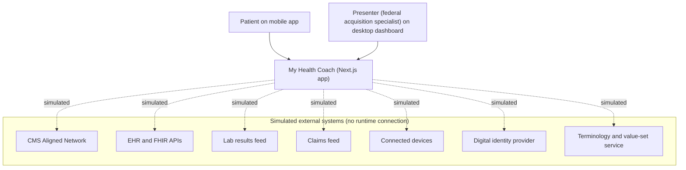
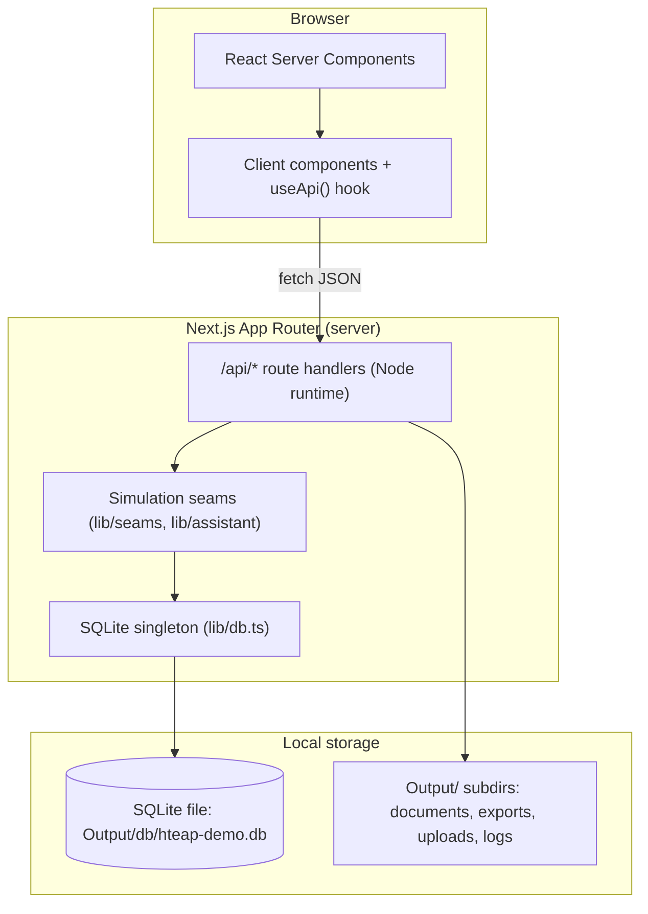
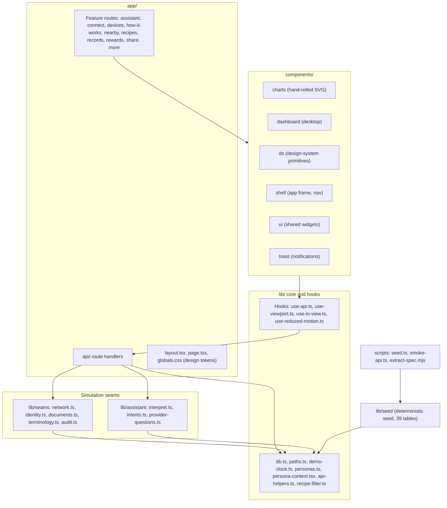
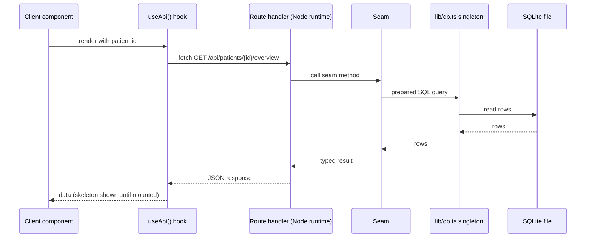
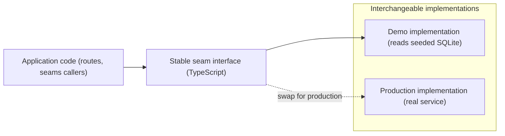
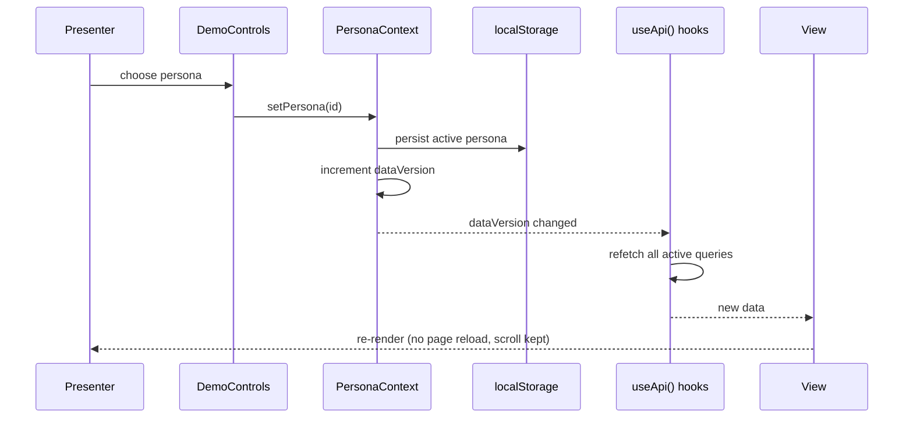
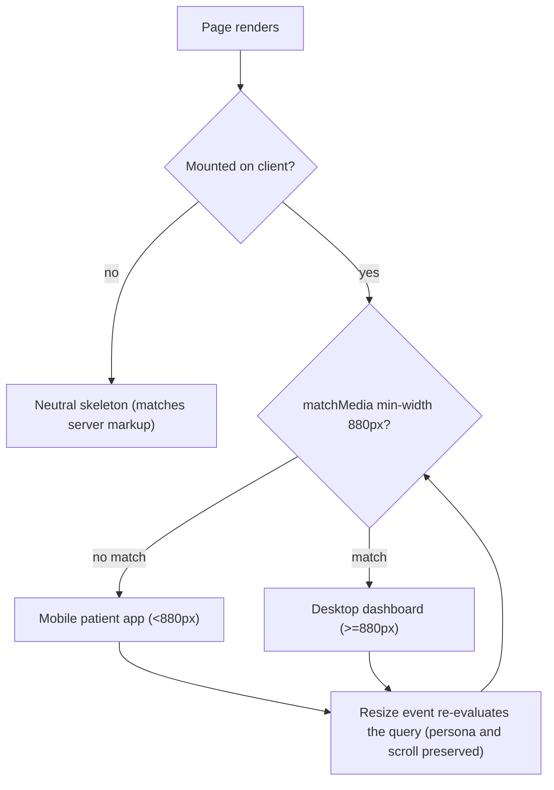

# Architecture

My Health Coach is a demo-only, responsive web application built for the CMS Health Tech Ecosystem Aligned Platform (HTEAP) "Patient-Facing Apps — Diabetes & Obesity" use case. It shows how a patient-facing app could connect to CMS Aligned Networks and, with patient consent, drive personalized coaching, reminders, and risk alerts across pre-diabetes prevention and active disease management. The audience is federal acquisition specialists, so the app favors visual fidelity to the approved prototypes, smooth animated charts, and instant persona swaps.

Everything in the running app is simulated. The app makes zero third-party network calls at runtime, transmits no protected health information (PHI), contains no real patient data, and holds no secrets. Every integration — FHIR and Aligned Network query, EHR, labs, claims, devices, identity, consent, documents, terminology, and AI interpretation — is faked in-app behind a clean interface boundary called a "seam." A production build can replace the demo implementation behind each seam without changing the rest of the app. My Health Coach is developed by Scope Infotech, Inc.

This document describes the actual current state of the repository. The app is fully built: a real `package.json` (version 1.0.0), the `app/`, `components/`, `lib/`, and `scripts/` trees, a deterministic seed that creates 39 tables, and roughly 34 internal API routes. There is no ESLint, Prettier, test runner, or continuous integration configured.

## Design goals and constraints

The architecture follows six rules. Each rule shapes many files.

- **Visual fidelity to the prototypes.** The UI ports the approved prototype CSS and copy directly. UI text is taken verbatim from the prototypes. Charts reuse the prototypes' viewBoxes, bands, gridlines, and labels.
- **Determinism.** A fixed demo clock replaces the current time. No code calls `Math.random()` or `new Date()`. Deleting the database and re-seeding produces a byte-identical file, and the seed script prints a SHA-256 hash to prove it.
- **Full simulation behind seams.** Each external dependency sits behind a stable TypeScript interface. The demo ships an in-app implementation that reads seeded data; a production build swaps in a real implementation.
- **Accessibility.** The app targets Section 508 and WCAG 2.1 AA, with a Lighthouse accessibility score of 95 or higher on both the mobile and desktop views.
- **Zero third-party runtime calls.** Fonts are self-hosted through `next/font`. No analytics, no remote APIs, no external assets at runtime.
- **Responsive, single codebase.** One application renders a mobile patient app below 880 pixels and a desktop dashboard at 880 pixels and above, switching live on resize.

## System context

Two human actors use the app. A patient uses the mobile patient app. A presenter — a federal acquisition specialist or solution reviewer — uses the desktop dashboard. The app stands in for every external system. The simulated systems below are drawn with dashed links to show that no real connection exists at runtime.

## Runtime and container view

The browser runs React Server Components and client components. Client components fetch data only from the app's own `/api/*` route handlers. Each route handler runs on the Node.js runtime — every route declares `export const runtime = 'nodejs'` because the SQLite driver is a native module and cannot run on the edge runtime. Route handlers call the seams, which read the single SQLite file through a `better-sqlite3` singleton. File storage lives under the `Output/` directory.

The driver is `better-sqlite3` version 11.10, which is synchronous, so route handlers read the database without `await`. The singleton in `lib/db.ts` is stored on `globalThis` so it survives Next.js hot reload during development. It opens the database with write-ahead logging (WAL) mode and foreign keys enabled. `next.config.ts` sets `serverExternalPackages: ['better-sqlite3']` so the native module is not bundled, and sets a `distDir` that can be overridden with the `HTEAP_DIST_DIR` environment variable.

## Code and layer map

The code splits into the routed application (`app/`), presentation components (`components/`), shared logic and hooks (`lib/`), the simulation seams (`lib/seams/` and `lib/assistant/`), the seed module (`lib/seed/`), and command-line scripts (`scripts/`).

## Request lifecycle

A typical read follows one path. A client component calls the `useApi()` hook, which fetches from an internal route such as `GET /api/patients/{id}/overview`. The route handler runs on the Node runtime, calls the relevant seam, and reads SQLite through the `lib/db.ts` singleton. The handler returns JSON, and the component renders it. Until the viewport hook reports that the component has mounted, the shell renders a neutral skeleton so the server and client markup match and the layout does not shift.

## Simulation seams

A seam is a stable TypeScript interface with two possible implementations. The demo implementation reads seeded rows and returns deterministic results. A production implementation can satisfy the same interface using a real service. Because the rest of the app depends only on the interface, swapping implementations does not ripple outward. The table lists each seam, its module, its demo behavior, and the production target it is designed to accept.

| Seam                 | Module                                                      | Demo behavior                                                                                                             | Production target                                                 |
| -------------------- | ----------------------------------------------------------- | ------------------------------------------------------------------------------------------------------------------------- | ----------------------------------------------------------------- |
| AlignedNetworkClient | `lib/seams/network.ts`                                      | Reads `record_locator_results`; adds seeded 400 to 1200 ms latency; updates `last_sync_at`                                | CMS Aligned Network query, FHIR `$everything`, SMART Health Links |
| IdentityProvider     | `lib/seams/identity.ts`                                     | Scripted IAL2 and AAL2 passkey or mobile driver's license check; deterministic session token; writes `access_log`         | CMS digital identity plus OAuth 2.0                               |
| DocumentStore        | `lib/seams/documents.ts`                                    | Serves seeded `clinical_documents` rows                                                                                   | Real document repository with OCR                                 |
| TerminologyService   | `lib/seams/terminology.ts`                                  | Illustrative LOINC, RxNorm, and SNOMED codes                                                                              | Governed value-set service                                        |
| interpret()          | `lib/assistant/interpret.ts` and `lib/assistant/intents.ts` | Deterministic on-device intent engine: keyword match selects a template from `assistant_intents`; no large language model | Governed clinical model behind the same contract                  |
| AuditLog             | `lib/seams/audit.ts`                                        | Appends to `access_log` with actor, timestamp, scope, and purpose of use                                                  | Tamper-evident audit trail                                        |

The next diagram shows the seam boundary. The application depends on the interface. The interface has exactly one active implementation at a time: the demo implementation today, a production implementation later.

## Personas and instant swap

The app ships 13 personas: the featured persona `sarah`; the diabetes group `maria`, `robert`, `jim`, `priya`, `hector`, `linda`, and `deshawn`; and the obesity group `samuel`, `aisha`, `carol`, `miguel`, and `emily`. The roster lives in `lib/personas.ts` as `PERSONA_IDS`, `PERSONA_GROUPS`, and `DEFAULT_PERSONA`. `PersonaContext` in `lib/persona-context.tsx` holds the active persona in React Context and mirrors it to `localStorage` so the choice persists for the session.

Switching personas does not reload the page. The persona control updates the context, which bumps a global `dataVersion` counter. Every `useApi()` hook depends on `dataVersion`, so all hooks refetch and the whole screen re-renders with the new persona's data. Scroll position is preserved.

## Responsive view switching

One codebase serves two layouts. The hook `lib/use-viewport.ts` reads `matchMedia('(min-width:880px)')` through `useSyncExternalStore`, which keeps React in sync with the browser media query. Below 880 pixels the app renders the mobile patient app. At 880 pixels and above it renders the desktop dashboard. The switch happens live on resize, and the active persona and scroll position carry across. Until the component reports that it has mounted, the shell renders a neutral skeleton, which avoids a hydration mismatch between server and client.

## Determinism and the demo clock

The app freezes time. `lib/demo-clock.ts` defines `DEMO_TODAY` as `2026-06-06` (a Friday) and `DEMO_NOW_ISO` as `2026-06-06T09:41:00`. Every relative date, chart range, and time-based string derives from these constants. No code calls `new Date()` for live time or `Math.random()` for variation.

Latency is deterministic too. `seededJitterMs(key, min, max)` returns a stable millisecond value derived from the key, so the simulated network sync produces the same delay every run for the same input. Because all values derive from fixed inputs, deleting `Output/db/hteap-demo.db` and re-running the seed produces a byte-identical database file. The seed script prints a SHA-256 hash of the file so a reviewer can confirm the output has not changed.

## Data model

The seed creates 39 tables. The entity-relationship diagram below shows a representative subset, not the full schema. `patients` is the hub. Most clinical and engagement tables hang off `patients` with a one-to-many relationship. Care-team messaging and device pairing each form their own small chains.

```mermaid
erDiagram
  patients ||--o{ lab_results : has
  patients ||--o{ observations : records
  patients ||--o{ conditions : diagnosed
  patients ||--o{ medications : prescribed
  patients ||--o{ goals : sets
  patients ||--o{ coach_messages : receives
  patients ||--o{ programs : enrolled
  patients ||--o{ alerts : raises
  patients ||--o{ social_drivers : has
  patients ||--o{ claims_events : generates
  patients ||--o{ ai_insights : surfaced
  patients ||--o{ clinical_documents : holds
  patients ||--o{ symptom_checkins : logs
  patients ||--o{ journey_steps : follows
  patients ||--o{ data_sources : connects
  patients ||--o{ record_locator_results : locates
  patients ||--o{ access_log : audited_by
  patients ||--|| consents : grants
  patients ||--|| gamification : tracked_by
  patients ||--|| nutrition_summary : summarized_by

  medications ||--o{ medication_days : adherence
  medications ||--o{ med_events_today : doses

  care_team ||--o{ provider_threads : owns
  provider_threads ||--o{ provider_messages : contains
  care_team ||--o{ appointment_slots : offers

  device_catalog ||--o{ patient_devices : cataloged_as
  patients ||--o{ patient_devices : pairs

  assistant_intents ||--o{ assistant_suggested : suggests

  patients {
    text id PK
    text first_name
    text last_name_initial
    integer age
    text category
    integer featured
    text plan_type
    text condition_detail
    text medicare_context
    integer dual_eligible
  }
  lab_results {
    text loinc
    real value
    text range_flag
    text collected_on
  }
  observations {
    text type
    real value
    text observed_on
  }
  conditions {
    text snomed
    text onset_date
    text status
  }
  medications {
    text rxnorm
    text dose
    text timing
  }
  consents {
    text granted_on
    text method
    text ial
    text aal
    integer access_reads_this_month
    integer revoked
  }
  gamification {
    integer points
    text level_name
    integer current_streak_days
  }
  access_log {
    text occurred_at
    text actor
    text actor_role
    text scope
    text purpose_of_use
  }
```

Beyond the clusters above, the schema also holds global lookup and engagement tables, including `badges`, `patient_badges`, `challenges`, `recipes`, `local_services`, and `app_meta`.

## Accessibility architecture

Accessibility is a build requirement, not a later pass. The app targets Section 508 and WCAG 2.1 AA, with a Lighthouse accessibility score of 95 or higher on both views. Each chart SVG carries `role="img"` and a descriptive `aria-label`, and pairs with an alternative data table so the same information is available without the graphic. Status is always conveyed by both color and icon, never by color alone, so the app does not depend on color perception. The shell includes a skip-to-main link and supports full keyboard navigation. The app honors `prefers-reduced-motion: reduce` by rendering final chart states immediately.

## Charts

Charts are hand-rolled SVG React components in `components/charts/`. The app uses no chart library. Each chart reuses the prototype geometry — the same viewBox, bands, gridlines, and labels — so the demo matches the approved designs.

Charts animate when they scroll into view. The `lib/use-in-view.ts` hook wraps `IntersectionObserver` with a threshold of 0.35, and each chart animates once per session. The `lib/use-reduced-motion.ts` hook reads `prefers-reduced-motion`; when a user prefers reduced motion, the chart renders its final state immediately and skips the animation. Animations change only transform, opacity, and stroke properties, so they never trigger layout reflow.

## Production migration path

Each seam is the single place to replace demo behavior with a real implementation. The interface stays the same, so callers do not change.

- **AlignedNetworkClient** (`lib/seams/network.ts`): replace seeded `record_locator_results` reads with a CMS Aligned Network query, a FHIR `$everything` call, and SMART Health Links. Replace the seeded latency with real network timing.
- **IdentityProvider** (`lib/seams/identity.ts`): replace the scripted IAL2 and AAL2 check with CMS digital identity and an OAuth 2.0 flow, and write the same audit entries.
- **DocumentStore** (`lib/seams/documents.ts`): replace seeded `clinical_documents` rows with a real document repository, adding OCR where source documents are scanned.
- **TerminologyService** (`lib/seams/terminology.ts`): replace illustrative codes with a governed value-set service for LOINC, RxNorm, and SNOMED.
- **interpret()** (`lib/assistant/interpret.ts`): replace the deterministic on-device intent engine with a governed clinical model that satisfies the same `interpret()` contract.
- **AuditLog** (`lib/seams/audit.ts`): replace the `access_log` append with a tamper-evident audit trail.

Two further changes belong to a production build: replace the SQLite file with a managed database, and replace the fixed demo clock with the real system clock. Both are isolated — the database behind `lib/db.ts` and time behind `lib/demo-clock.ts` — so the rest of the app is unaffected.

## References

- [Docs/spec/hteap-demo-app-prd.html](Docs/spec/hteap-demo-app-prd.html) — the product requirements document and normative contract, including requirements FR-1 through FR-35, design tokens, the API spec, seed data, and the SQL DDL.
- [Docs/spec/USER-STORIES.md](Docs/spec/USER-STORIES.md) — normative acceptance criteria across five user types and 24 stories.
- [Docs/Style/CMS Web Design System/](Docs/Style/CMS%20Web%20Design%20System/) — the "Institutional Integrity" brand and the canonical design-token specification.
- [DEVELOPMENT.md](DEVELOPMENT.md) — local setup, scripts, and the seed workflow.
- [CONTRIBUTING.md](CONTRIBUTING.md) — contribution process and conventions.
- [SECURITY.md](SECURITY.md) — security posture and reporting.

---

 

**Copyright © 2026 Scope Infotech, Inc. All rights reserved.**

My Health Coach is a concept demonstration. It is not an official CMS product and is not for clinical use.

