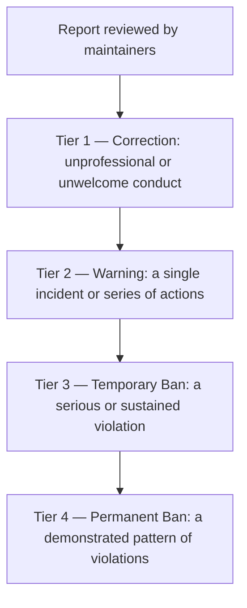

# Contributor Covenant Code of Conduct

## Our Pledge

We as members, contributors, and leaders pledge to make participation in our
community a harassment-free experience for everyone, regardless of age, body
size, visible or invisible disability, ethnicity, gender identity and
expression, level of experience, education, socio-economic status, nationality,
personal appearance, race, religion, or identity and orientation.

We pledge to act and interact in ways that contribute to an open, welcoming,
diverse, inclusive, and healthy community.

## Our Standards

Examples of behavior that contributes to a positive environment for our
community include:

- Demonstrating empathy and kindness toward other people.
- Being respectful of differing opinions, viewpoints, and experiences.
- Giving and gracefully accepting constructive feedback.
- Accepting responsibility and apologizing to those affected by our mistakes,
  and learning from the experience.
- Focusing on what is best not just for us as individuals, but for the overall
  community.

Examples of unacceptable behavior include:

- Harassment of any kind, whether in public or private.
- Insulting, demeaning, or derogatory comments, and personal or political
  attacks.
- Unwelcome personal attention or advances.
- Trolling or other deliberately disruptive behavior.
- Publishing other people's private information, such as a physical or
  electronic address, without their explicit permission.
- Other conduct which could reasonably be considered inappropriate in a
  professional setting.

## Enforcement Responsibilities

Community leaders are responsible for clarifying and enforcing our standards of
acceptable behavior and will take appropriate and fair corrective action in
response to any behavior that they deem inappropriate, threatening, offensive,
or harmful.

Community leaders have the right and responsibility to remove, edit, or reject
comments, commits, code, wiki edits, issues, and other contributions that are
not aligned to this Code of Conduct, and will communicate reasons for moderation
decisions when appropriate.

## Scope

This Code of Conduct applies within all community spaces, and also applies when
an individual is officially representing the community in public spaces.
Examples of representing our community include using an official email address,
posting via an official social media account, or acting as an appointed
representative at an online or offline event.

## Enforcement

Instances of abusive, harassing, or otherwise unacceptable behavior may be
reported to the community leaders responsible for enforcement. For this project,
report privately to the repository maintainers (Scope Infotech, Inc.) through
GitHub. Because this is an internal Scope Infotech project, Scope personnel may
also raise concerns through Scope's standard human resources or management
channels.

Please note: GitHub's private vulnerability reporting and Security Advisories are
for security issues only (see [SECURITY.md](SECURITY.md)), not conduct reports.

All complaints will be reviewed and investigated promptly and fairly. All
community leaders are obligated to respect the privacy and security of the
reporter of any incident.

## Enforcement Guidelines

Community leaders will follow these Community Impact Guidelines in determining
the consequences for any action they deem in violation of this Code of Conduct:

### 1. Correction

**Community Impact**: Use of inappropriate language or other behavior deemed
unprofessional or unwelcome in the community.

**Consequence**: A private, written warning from community leaders, providing
clarity around the nature of the violation and an explanation of why the
behavior was inappropriate. A public apology may be requested.

### 2. Warning

**Community Impact**: A violation through a single incident or series of
actions.

**Consequence**: A warning with consequences for continued behavior. No
interaction with the people involved, including unsolicited interaction with
those enforcing the Code of Conduct, for a specified period of time. This
includes avoiding interactions in community spaces as well as external channels
like social media. Violating these terms may lead to a temporary or permanent
ban.

### 3. Temporary Ban

**Community Impact**: A serious violation of community standards, including
sustained inappropriate behavior.

**Consequence**: A temporary ban from any sort of interaction or public
communication with the community for a specified period of time. No public or
private interaction with the people involved, including unsolicited interaction
with those enforcing the Code of Conduct, is allowed during this period.
Violating these terms may lead to a permanent ban.

### 4. Permanent Ban

**Community Impact**: Demonstrating a pattern of violation of community
standards, including sustained inappropriate behavior, harassment of an
individual, or aggression toward or disparagement of classes of individuals.

**Consequence**: A permanent ban from any sort of public interaction within the
community.

### Enforcement ladder

The four tiers escalate with the severity and persistence of the behavior:

## Attribution

This Code of Conduct is adapted from the [Contributor Covenant][homepage],
version 2.1, available at
<https://www.contributor-covenant.org/version/2/1/code_of_conduct.html>. The
examples of unacceptable behavior have been generalized for this project.

Community Impact Guidelines were inspired by
[Mozilla's code of conduct enforcement ladder][mozilla coc].

For answers to common questions about this code of conduct, see the FAQ at
<https://www.contributor-covenant.org/faq>. Translations are available at
<https://www.contributor-covenant.org/translations>.

The Contributor Covenant is licensed under [CC BY 4.0][cc-by-4.0].

[homepage]: https://www.contributor-covenant.org
[mozilla coc]: https://github.com/mozilla/diversity
[cc-by-4.0]: https://creativecommons.org/licenses/by/4.0/

---

 

**Copyright © 2026 Scope Infotech, Inc. All rights reserved.**

My Health Coach is a concept demonstration. It is not an official CMS product and is not for clinical use.

