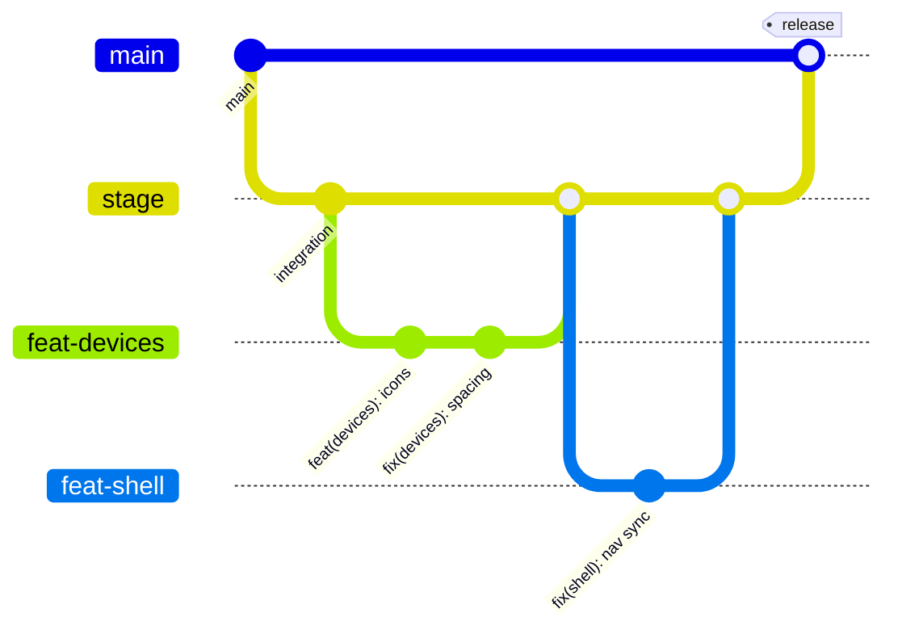
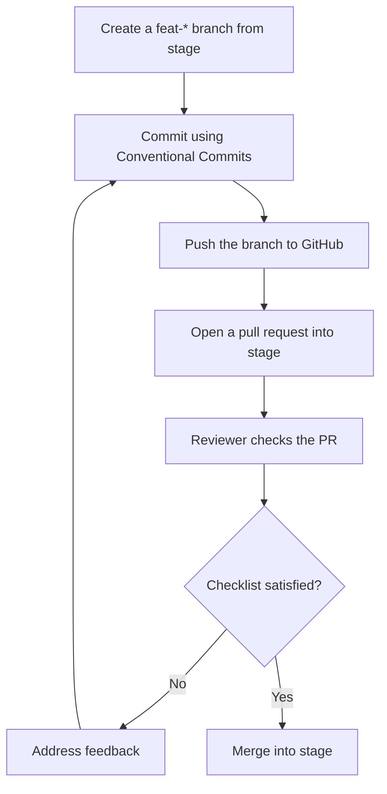

# Contributing

Thank you for your interest in **My Health Coach**, a concept demonstration built by Scope Infotech, Inc. for the CMS HTEAP "Patient-Facing Apps — Diabetes & Obesity" use case. This guide explains how to propose changes. By taking part, you agree to follow our [Code of Conduct](CODE_OF_CONDUCT.md).

The app is demo-only. It uses fictional data, makes no third-party network calls at runtime, and is not an official CMS product. Keep changes within that boundary.

## Before you start

Read these first so your change fits the design and the rules:

- [Docs/spec/hteap-demo-app-prd.html](Docs/spec/hteap-demo-app-prd.html) — the product requirements document (the contract).
- [Docs/spec/USER-STORIES.md](Docs/spec/USER-STORIES.md) — the acceptance criteria. Validate features against these.
- [ARCHITECTURE.md](ARCHITECTURE.md) — how the system fits together and where the simulation seams are.

## Development setup

See [DEVELOPMENT.md](DEVELOPMENT.md) for prerequisites, the quick start, the seed workflow, and troubleshooting. This guide does not repeat those steps.

## Branching model

`main` is the default branch and holds released work. `stage` is the integration branch. Create a `feat-*` branch for each change and open your pull request against `stage`; `stage` merges into `main` for a release.



## Commit messages

Use [Conventional Commits](https://www.conventionalcommits.org/): `type(scope): subject`.

Common types:

- `feat` — a new feature.
- `fix` — a bug fix.
- `docs` — documentation only.
- `chore` — tooling or housekeeping with no production code change.
- `refactor` — a code change that neither fixes a bug nor adds a feature.

Scopes name the area you touched, for example `shell`, `devices`, `api`, `charts`, `seed`, or `personas`.

Examples in the style used in this repository:

```text
fix(shell): keep nav highlight in sync with in-page section clicks
feat(devices): device-type icons on cards
docs: comprehensive README, Apache 2.0 license, and brand assets
```

## Pull request process



Before requesting review, confirm every item below:

- [ ] **Seed stays deterministic.** `npm run seed` still prints a stable SHA-256, and re-seeding yields a byte-identical database. No `Math.random()` and no `new Date()` were introduced.
- [ ] **Accessibility holds.** Lighthouse accessibility is >= 95 on both the mobile and desktop views.
- [ ] **UI copy is verbatim.** Any user-facing text matches the prototypes in `Docs/example/` exactly, with no paraphrasing.
- [ ] **No third-party runtime calls.** The change adds no network calls to any external service at runtime.
- [ ] **API routes keep the Node runtime.** Every route handler under `app/api/` still declares `export const runtime = 'nodejs'`.
- [ ] **No hardcoded display data.** Components render only data from `/api/*` (fixed chart geometry is the sole exception).
- [ ] **Works across all 13 personas.** The feature behaves correctly for `sarah`, `maria`, `robert`, `jim`, `priya`, `hector`, `linda`, `deshawn`, `samuel`, `aisha`, `carol`, `miguel`, and `emily`.
- [ ] **Disclaimer and footer intact.** The "fictional data / not an official CMS product" disclaimer still appears on every route.

## Coding standards

Full coding standards are in [DEVELOPMENT.md](DEVELOPMENT.md#coding-standards). In short:

- **Determinism.** All values derive from the fixed demo clock in [lib/demo-clock.ts](lib/demo-clock.ts) (`DEMO_TODAY = '2026-06-06'`). No wall-clock dates, no random values.
- **Simulation seams.** Every external integration is faked in-app behind a clean interface. The assistant is a deterministic on-device intent engine, not an LLM. Do not add real FHIR, OAuth, identity, or PHI.
- **Accessibility.** Section 508 / WCAG 2.1 AA. Status is shown by color **and** an icon. `prefers-reduced-motion: reduce` is honored.
- **Verbatim copy.** User-facing text comes from the prototypes, never paraphrased.

Also: TypeScript strict, Server Components by default, CSS Modules with custom-property tokens (no Tailwind, no UI kit), and hand-rolled SVG charts (no chart library).

## Reporting bugs and requesting features

Open a GitHub Issue at [github.com/Scope-Infotech-Inc/my-health-coach-demo/issues](https://github.com/Scope-Infotech-Inc/my-health-coach-demo/issues). Describe what you expected, what happened, the persona and view (mobile or desktop) you used, and the steps to reproduce.

## Security issues

Do not open a public issue for a security problem. Follow the private reporting process in [SECURITY.md](SECURITY.md).

## License

This project is licensed under the Apache License 2.0 (see [LICENSE](LICENSE)). By contributing, you agree that your contributions are accepted under the same license.

---

<div align="center">
<br/>


**Copyright © 2026 Scope Infotech, Inc. All rights reserved.**

<sub>My Health Coach is a concept demonstration. It is not an official CMS product and is not for clinical use.</sub>

</div>
