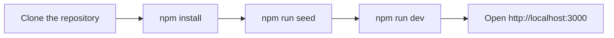
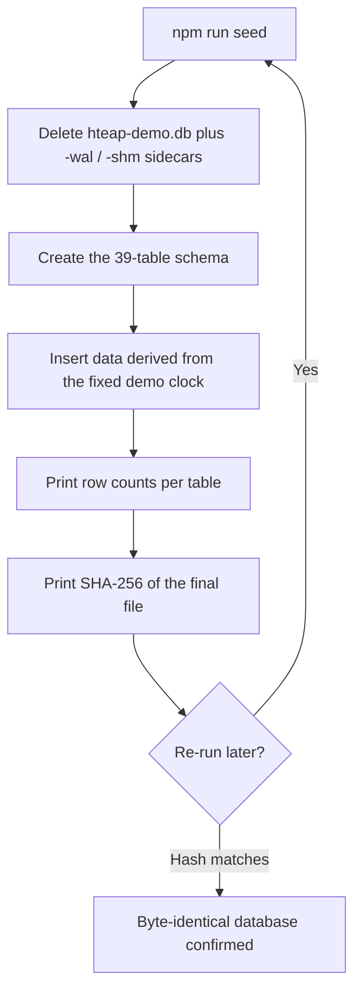

# Development guide

This guide explains how to set up, run, seed, and troubleshoot **My Health Coach** on your own machine. The app is a demo-only, responsive Next.js 15 + SQLite build for the CMS HTEAP "Patient-Facing Apps — Diabetes & Obesity" use case. Everything is simulated: the running app makes no third-party network calls, holds no PHI, and needs no secrets or API keys. For the deeper picture of how the pieces fit together — the simulation seams, the data flow, and the chart layer — read [ARCHITECTURE.md](ARCHITECTURE.md).

## Prerequisites

- **Node.js 20 or later** and **npm**. The `engines` field in [package.json](package.json) pins Node `>=20`.
- **A C/C++ build toolchain.** `better-sqlite3` is a native addon that compiles during `npm install`, so you need a working compiler:
  - **macOS:** Xcode Command Line Tools (`xcode-select --install`).
  - **Linux:** `build-essential` and Python 3 (for example, `sudo apt-get install build-essential python3`).
  - **Windows:** the Visual Studio Build Tools (the "Desktop development with C++" workload).
- **No external services.** You do not need a database server, an account, network access at runtime, or any environment secrets. The app contacts nothing outside itself.
- **Gitleaks** (for committing). The pre-commit hook scans staged changes for secrets and **blocks the commit if `gitleaks` is not installed**. Install it with `brew install gitleaks` (macOS) or follow the [gitleaks install guide](https://github.com/gitleaks/gitleaks#installing). See [Secret scanning](#secret-scanning).

## Quick start



Run the same steps from a terminal:

```bash
git clone https://github.com/Scope-Infotech-Inc/my-health-coach-demo.git
cd my-health-coach-demo
npm install
npm run seed
npm run dev
# then open http://localhost:3000
```

`npm install` compiles `better-sqlite3` from source the first time, so it can take a minute. `npm run seed` builds the local SQLite database (see below). `npm run dev` starts the Next.js dev server on port 3000.

## npm scripts

| Script  | Command               | What it does                                                                         |
| ------- | --------------------- | ------------------------------------------------------------------------------------ |
| `dev`   | `next dev`            | Starts the Next.js development server with hot reload on `http://localhost:3000`.    |
| `build` | `next build`          | Produces a production build. Honors `HTEAP_DIST_DIR` for the output directory.       |
| `start` | `next start`          | Serves the production build created by `npm run build`.                              |
| `seed`  | `tsx scripts/seed.ts` | Rebuilds the SQLite database from scratch. Idempotent and deterministic (see below). |

## Environment variables

Both variables are optional. The app runs with neither set.

| Variable           | Default         | Purpose                                                                                                                                                                                             |
| ------------------ | --------------- | --------------------------------------------------------------------------------------------------------------------------------------------------------------------------------------------------- |
| `HTEAP_OUTPUT_DIR` | `<repo>/Output` | Base directory for all runtime file storage: `db/`, `documents/`, `exports/`, `uploads/`, and `logs/`. Resolved in [lib/paths.ts](lib/paths.ts). The app never reads or writes outside this tree.   |
| `HTEAP_DIST_DIR`   | `.next`         | Overrides the Next.js build output directory. Set in [next.config.ts](next.config.ts). Useful when a test harness needs an isolated `.next` so concurrent Next processes do not share build output. |

No secrets, tokens, or API keys exist or are required.

## Database and seed workflow

The app uses a single SQLite file at **`Output/db/hteap-demo.db`**, opened through a singleton in [lib/db.ts](lib/db.ts). The path resolves in [lib/paths.ts](lib/paths.ts) and moves with `HTEAP_OUTPUT_DIR` if you set it.

`npm run seed` ([scripts/seed.ts](scripts/seed.ts)) rebuilds that file end to end:



The seed is **deterministic**. It uses no `Math.random()` and no `new Date()`; every value derives from the fixed demo clock. Because of this, re-seeding produces a **byte-identical** database, which the printed SHA-256 lets you confirm. The seed opens its own short-lived connection (not the app singleton) and writes with the default rollback journal, so the on-disk file is stable rather than left in WAL mode.

**To reset the data**, delete the database and re-seed:

```bash
rm -f Output/db/hteap-demo.db Output/db/hteap-demo.db-wal Output/db/hteap-demo.db-shm
npm run seed
```

`npm run seed` already deletes the file and its `-wal`/`-shm` sidecars before rebuilding, so re-running it is enough on its own; the explicit `rm` above is only needed if you want to clear the database without immediately rebuilding it. The app also exposes a `demo/reset` route that re-runs the seed from within the running app.

## The demo clock

The demo has a fixed "today" so that screenshots, chart ranges, and copy never drift. [lib/demo-clock.ts](lib/demo-clock.ts) defines:

- `DEMO_TODAY = '2026-06-06'` — rendered as a Friday in the demo fiction.
- `DEMO_NOW_ISO = '2026-06-06T09:41:00'` — the fixed "now" (morning, so greetings read "Good morning").

**Rule:** never read the wall clock and never call `Math.random()`. Every date, relative label ("Yesterday", "3 min ago"), chart range, and any simulated latency must derive from these constants. The clock module provides the helpers for this (for example `daysFromToday`, `relativeDayLabel`, and a seeded jitter function for fake sync delays). Wall-clock dates or random values break the byte-identical seed guarantee.

## Working with personas

The demo ships **13 personas**, defined in [lib/personas.ts](lib/personas.ts):

- **Featured:** `sarah`
- **Diabetes:** `maria`, `robert`, `jim`, `priya`, `hector`, `linda`, `deshawn`
- **Obesity:** `samuel`, `aisha`, `carol`, `miguel`, `emily`

Switch personas using the in-app persona toggle. Switching **refetches all data through the `/api/*` routes with no page reload** and persists per session. Many features are persona-specific, so when you build or change a feature, **verify it across all 13 personas** — not only the default `sarah`. The persona list itself is demo chrome; every patient-facing value still renders from API responses backed by SQLite.

## Coding standards

The contribution-process details live in [CONTRIBUTING.md](CONTRIBUTING.md). The non-negotiable code rules are:

- **TypeScript strict.** `strict` is on in [tsconfig.json](tsconfig.json) (target ES2022, `moduleResolution: "bundler"`, path alias `@/*` → repo root).
- **Node runtime on every API route.** Each route handler under `app/api/` must declare `export const runtime = 'nodejs'`. `better-sqlite3` is synchronous and native; the edge runtime cannot load it.
- **Server Components by default.** Add `'use client'` only where interactivity requires it.
- **No hardcoded display data.** Components render only data fetched from internal `/api/*` routes that read SQLite. The single exception is fixed chart geometry (viewBoxes, gridline positions, band thresholds).
- **CSS Modules and CSS custom-property tokens.** No Tailwind and no UI kit. Port the prototype CSS directly.
- **Hand-rolled SVG charts.** No chart library. Reuse the prototypes' viewBoxes, bands, gridlines, and labels.
- **Verbatim UI copy.** Take all user-facing text from the prototypes in [Docs/example/](Docs/example/). Never paraphrase.
- **Accessibility is a requirement.** Section 508 / WCAG 2.1 AA. Every chart SVG needs `role="img"` and a descriptive `aria-label` plus an alternative data table. Status is shown by color **and** an icon, never color alone. Honor `prefers-reduced-motion: reduce` by rendering the final state immediately.
- **Permanent disclaimer.** A "fictional data / not an official CMS product" banner appears on every route.
- **Simulation seams.** Every external integration (FHIR / Aligned Network, EHR, labs, claims, devices, identity, consent, documents, terminology, AI interpretation) is faked in-app behind a clean interface. The assistant is a deterministic on-device intent engine, not an LLM. Keep the seams intact.

## Accessibility checks

Target **Lighthouse accessibility >= 95 on both views** (mobile patient app and desktop dashboard).

- **Lighthouse:** open `http://localhost:3000` in Chrome, then DevTools > Lighthouse > Accessibility, and run it once narrower than 880px and once at 880px or wider so both layouts are scored. You can also run it from the command line:
  ```bash
  npx lighthouse http://localhost:3000 --only-categories=accessibility --view
  ```
- **axe:** install the axe DevTools browser extension, or run the engine from the command line against the running dev server:
  ```bash
  npx @axe-core/cli http://localhost:3000
  ```

These tools are run on demand; they are not wired into the project as dependencies or scripts.

## Secret scanning

Commits and pull requests are scanned for secrets (API keys, tokens, private keys, and the like) with [gitleaks](https://github.com/gitleaks/gitleaks). The repository holds no real secrets, and this gate keeps it that way.

Two gates run automatically; a third you can run by hand:

- **On `git commit` (local).** The [.husky/pre-commit](.husky/pre-commit) hook runs `gitleaks git --staged` over your staged changes and blocks the commit on a finding. The hook needs the `gitleaks` binary (see [Prerequisites](#prerequisites)); if it is missing, the commit is blocked with install instructions.
- **On every pull request (CI).** The [gitleaks workflow](.github/workflows/gitleaks.yml) scans the commits the PR introduces and fails the **Scan for secrets** check on a finding. When that check is marked Required on the protected branch, a finding blocks the merge.
- **On demand.** `npm run secrets:scan` scans the whole working tree the same way.

Detection uses gitleaks' built-in rules; repo-specific exceptions live in [.gitleaks.toml](.gitleaks.toml). To allow a specific known-safe match, prefer an inline `gitleaks:allow` comment on that line over widening the config.

In a genuine emergency you can bypass the local hook with `git commit --no-verify`, but the pull request gate still runs, so a real secret is caught before merge.

## Troubleshooting

- **`better-sqlite3` errors after a Node upgrade.** A native addon compiled for one Node major version will not load on another. Rebuild it:
  ```bash
  npm rebuild better-sqlite3
  ```
- **Node version mismatch.** Confirm `node --version` reports 20 or later. There is no `.nvmrc`; set your version manager manually.
- **Port 3000 already in use.** Stop the other process, or run on a different port: `npm run dev -- -p 3001`.
- **Stale or locked database, or leftover `-wal` / `-shm` files.** Delete the database and its sidecars, then re-seed (see "Database and seed workflow"). The seed always rebuilds from a clean slate.
- **Native build fails during `npm install`.** Confirm the toolchain from "Prerequisites" is installed (Xcode Command Line Tools on macOS, `build-essential` + Python on Linux, Visual Studio Build Tools on Windows), then delete `node_modules` and run `npm install` again.

## Tooling status

State of the build tooling, plainly:

- **Linting.** ESLint is configured in [eslint.config.mjs](eslint.config.mjs) (flat config, `eslint-config-next` + `eslint-config-prettier`). Run `npm run lint` or `npm run lint:fix`.
- **Formatting.** Prettier is configured in [.prettierrc.json](.prettierrc.json) with [.prettierignore](.prettierignore). Run `npm run format` or `npm run format:check`.
- **Git hooks.** Husky runs the hooks in [.husky/](.husky/): `pre-commit` runs lint-staged (ESLint + Prettier on staged files) followed by a gitleaks secret scan; `pre-push` runs `npm run typecheck`.
- **Secret scanning.** gitleaks runs on commit and on every pull request — see [Secret scanning](#secret-scanning).
- **Continuous integration.** A GitHub Actions workflow ([.github/workflows/gitleaks.yml](.github/workflows/gitleaks.yml)) runs the secret-scanning gate on every pull request. No build, lint, or test job is wired into CI yet.
- **No automated tests.** There is no test runner or test suite. (Two ad hoc Node scripts exist under `scripts/` — `smoke-api.ts` and `extract-spec.mjs` — but they are not a test framework.)

There is no `.nvmrc`, `.npmrc`, or `.editorconfig`. Set your Node version (`>=20`) manually.

## References

- [ARCHITECTURE.md](ARCHITECTURE.md) — system architecture, simulation seams, and data flow.
- [CONTRIBUTING.md](CONTRIBUTING.md) — branching model, commit conventions, and the pull request process.
- [SECURITY.md](SECURITY.md) — how to report a security issue.
- [Docs/spec/hteap-demo-app-prd.html](Docs/spec/hteap-demo-app-prd.html) — the product requirements document (the contract).

---

<div align="center">
<br/>


**Copyright © 2026 Scope Infotech, Inc. All rights reserved.**

<sub>My Health Coach is a concept demonstration. It is not an official CMS product and is not for clinical use.</sub>

</div>
