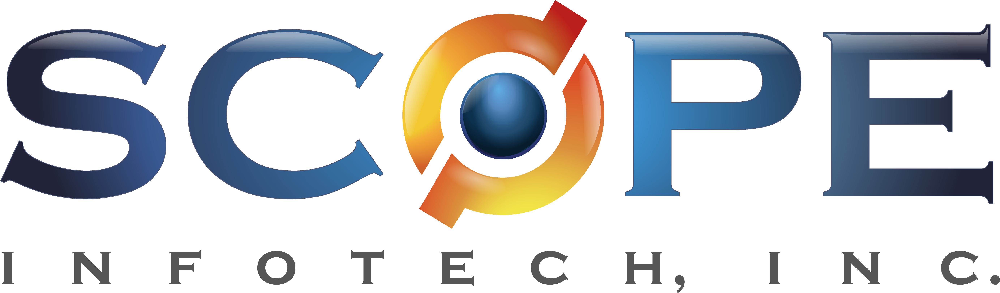
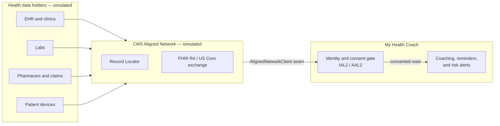
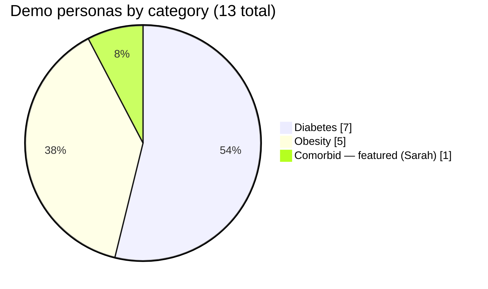
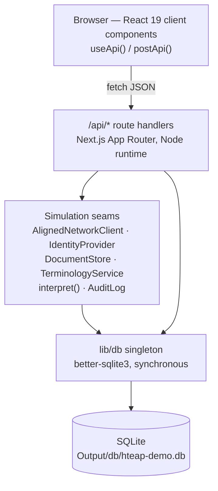
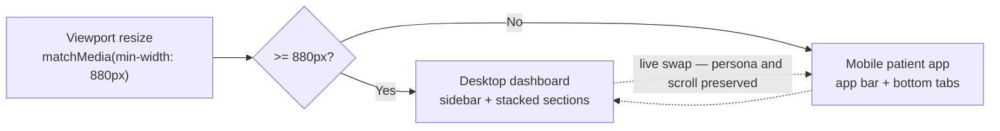
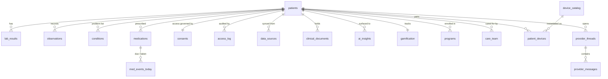
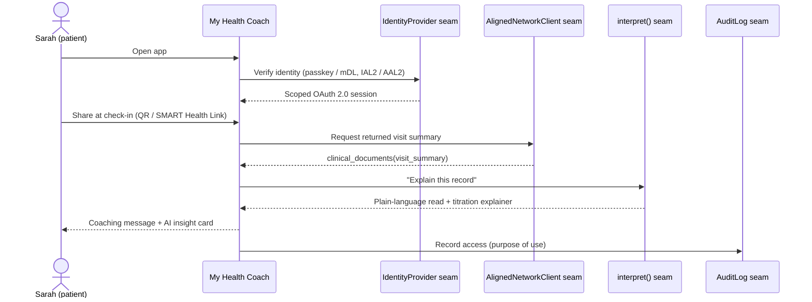

<div align="center">



<br/>

# My Health Coach

**A patient-facing digital health companion for the CMS Health Tech Ecosystem Aligned Platform (HTEAP) — Diabetes & Obesity use case.**

[](https://nextjs.org/)
[](https://react.dev/)
[](https://www.typescriptlang.org/)
[](https://github.com/WiseLibs/better-sqlite3)
[](https://nodejs.org/)
<br/>
[](#accessibility)
[-005EA2>)](#standards-and-interoperability)
[](#what-this-is)
[](LICENSE)
<br/>
[](ARCHITECTURE.md)
[](DEVELOPMENT.md)
[](CONTRIBUTING.md)
[](CODE_OF_CONDUCT.md)
[](SECURITY.md)
[](SUPPORT.md)

</div>

> [!IMPORTANT]
> **Concept prototype — all data is fictional and simulated. This is not an official CMS product and is not for clinical use.** Every external integration is mocked in-app. The running application makes no third-party network calls at runtime, transmits no protected health information (PHI), and contains no real patient data.

---

## Table of contents

- [What this is](#what-this-is)
- [Live demo](#live-demo)
- [Who it is for](#who-it-is-for)
- [The core design principle: everything is simulated](#the-core-design-principle-everything-is-simulated)
- [Features](#features)
- [Personas](#personas)
- [Architecture](#architecture)
- [Technology stack](#technology-stack)
- [Data model](#data-model)
- [API surface](#api-surface)
- [Guided journey](#guided-journey)
- [Project structure](#project-structure)
- [Getting started](#getting-started)
- [Deployment](#deployment)
- [Accessibility](#accessibility)
- [Standards and interoperability](#standards-and-interoperability)
- [Security and privacy](#security-and-privacy)
- [Testing](#testing)
- [Documentation](#documentation)
- [License](#license)

---

## What this is

**My Health Coach** is a demonstration web application built for the CMS Health Tech Ecosystem Aligned Platform (HTEAP) **"Patient-Facing Apps — Diabetes & Obesity"** use case. It turns two static HTEAP concept prototypes into one working, interactive system.

The application shows how a consumer health app could connect — here, _simulate_ connecting — to CMS Aligned Networks and, with the patient's consent, use a person's clinical and claims record to deliver personalized coaching, reminders, and risk alerts. It spans the full disease continuum the use case targets: **prevention** for people at risk (pre-diabetes) and **active management** for people living with diabetes or obesity.

The product is responsive and mobile-first. On a phone it presents a patient app; on a wider screen it presents a clinician-style dashboard. A presenter can switch between 13 patient personas instantly to show how the same product adapts to different conditions, coverage pathways, and engagement levels.

## Live demo

A temporary demo deployment is available at:

**https://mhc-demo.scopeinfotechinc.com**

The demo opens on an identity gate (a simulated IAL2/AAL2 sign-in), then the dashboard for the featured persona. Use the presenter controls to switch personas, replay a care-team alert, award a badge, or reset the demo to its seeded state.

## Who it is for

The primary audience is **federal health acquisition specialists and program stakeholders**. Accordingly, the application prioritizes:

- **Visual fidelity** to the approved HTEAP prototypes — layout, copy, and chart geometry are ported directly.
- **Clear data visualization** — hand-built SVG charts animate on scroll and respect reduced-motion preferences.
- **An instant persona switch** so a presenter can demonstrate prevention and active-management scenarios side by side without page reloads.

## The core design principle: everything is simulated

The application makes **zero runtime network calls to third-party services**. Every integration — Aligned Network / FHIR client, electronic health record (EHR), labs, claims, devices, identity, consent, document store, terminology service, and AI interpretation — is simulated inside the application against mock data in SQLite.

This is a deliberate engineering choice, not a shortcut. Each integration sits behind a clean TypeScript **interface seam**, so a production build can swap in a real implementation without reworking the database schema, the API contracts, or the user interface. The demo is engineered to represent a production-conformant product faithfully.



The simulation seams are:

| Seam                   | Demo behavior                                                                          | Production target                                                                  |
| ---------------------- | -------------------------------------------------------------------------------------- | ---------------------------------------------------------------------------------- |
| `AlignedNetworkClient` | Reads SQLite; runs a seeded Record Locator; applies deterministic latency              | CMS Aligned Network query/response, FHIR `$everything`, SMART Health Links         |
| `IdentityProvider`     | Scripted IAL2/AAL2 verification; deterministic session token                           | CMS digital identity (passkey / mobile driver's license) with OAuth 2.0 scopes     |
| `DocumentStore`        | Serves seeded clinical documents with real, accessible DOM text styled to look scanned | Real document repository with retrieval and OCR                                    |
| `TerminologyService`   | Illustrative LOINC / RxNorm / SNOMED codes                                             | Governed value-set service validated against official releases                     |
| `interpret()`          | Deterministic, on-device intent/template engine — **no language model**                | A governed clinical model behind the same request/response contract and guardrails |
| `AuditLog`             | Records access events to SQLite with purpose-of-use                                    | Tamper-evident audit trail                                                         |

## Features

Features are grouped by the spec revision that introduced them and map to functional requirements **FR-1 … FR-35** in the [product requirements document](Docs/spec/hteap-demo-app-prd.html).

### Core patient experience

- **Responsive patient app and dashboard.** A single product renders a mobile patient app below 880px and a desktop dashboard at or above it, switching live on resize.
- **Overview** with a personalized greeting, a persona status banner, and five stat tiles with trend deltas.
- **Trends & Labs** with animated SVG charts: A1c history with target zones, glucose and weight trends, a pre-diabetes risk scale, and a lab-history list with status icons.
- **Care & Medications** with a medication list, claims-driven refill readiness, and a four-week adherence grid.
- **Care & Prevention** with program enrollment, session progress, and milestone tracking (for example, the National Diabetes Prevention Program).
- **Activity & Nutrition** with weekly activity bars, goal lines, and nutrition progress against targets.
- **Coaching & Programs** — a coaching feed mixing human and automated messages, plus matched program cards.
- **Data & Consent** center with connected sources, consent details, a granular audit trail, and a one-tap revoke that drives disconnected empty states.

### Engagement and connection

- **Gamification & Rewards** — points, level ring, streaks, earned and locked badges, and challenges.
- **Smart-device connections** — connect a watch, scale, blood-pressure cuff, continuous glucose monitor, or glucose meter through a simulated pairing flow that reveals device-specific cards.
- **Connect with provider** — message threads with seeded simulated replies, data-snapshot sharing, and appointment booking.
- **AI assistant (chat and optional voice)** — a deterministic, on-device intent engine that answers questions from the patient's own data, cites its source, labels AI versus clinical judgment, and routes red-flag symptoms directly to care. Voice uses the browser-native Web Speech API where available.
- **Questions for your provider** — generates tailored questions from the patient's data and can post them into a provider thread.
- **Nearby services** — a category-filtered finder with a schematic, self-contained SVG map.
- **Healthy recipes** — auto-filtered by the active patient's condition, allergies, and dietary preferences.

### Interoperability and identity

- **Simulated Aligned Network sync and Record Locator** — discovers which organizations hold records, then refreshes source timestamps.
- **IAL2/AAL2 identity and consent gate** — a passkey or mobile-driver's-license sign-in followed by scoped OAuth 2.0 authorization before the dashboard loads.
- **Point-of-care sharing ("Kill the Clipboard / Ax the Fax")** — generate a QR code carrying a mock share token, simulate a check-in, and receive a visit summary back through a mock SMART Health Link.
- **Full-chart clinical records** — structured (coded) items plus unstructured documents (radiology, outside labs, specialist notes, visit summaries), each with an "Explain this" AI read.
- **AI interpretive insight cards** — proactive, seeded insights (trend, titration explainer, referral suggestion), each labeled "AI-generated, not clinical judgment" and citing its basis.
- **Semantic interoperability** — LOINC, RxNorm, and SNOMED codes shown in record detail views, framed as USCDI v3 / US Core. Codes are illustrative and flagged for validation.

### Presenter tooling

- **Instant 13-persona switch**, **replay care-team alert**, **award a badge**, **demo reset**, **count-up stat tiles**, and a **presenter-notes overlay**.

## Personas

The demo ships with **13 deterministic personas** across the diabetes and obesity continuum, including one featured comorbid persona. Switching personas re-fetches all data from the API without a page reload and persists per browser session.



| Group    | Personas                                                              | Notes                                                                       |
| -------- | --------------------------------------------------------------------- | --------------------------------------------------------------------------- |
| Featured | `sarah`                                                               | Type 2 diabetes + obesity, Medicare beneficiary; anchors the guided journey |
| Diabetes | `maria` · `robert` · `jim` · `priya` · `hector` · `linda` · `deshawn` | Spans prevention (pre-diabetes) through active Type 1 and Type 2 management |
| Obesity  | `samuel` · `aisha` · `carol` · `miguel` · `emily`                     | Obesity management, including nutrition and dietary-preference scenarios    |

Personas vary deliberately — well-controlled versus high-risk, device-rich versus none, high versus low engagement, and different CMS coverage pathways — so a presenter can show the same product handling very different situations.

## Architecture

The application is a single Next.js App Router project. The browser renders **only** data fetched from internal `/api/*` route handlers, which read SQLite through a singleton connection. Chart geometry constants are the sole exception to "no hardcoded display data."



Key architectural rules:

- **Node runtime everywhere.** Every API route runs on the Node runtime (`export const runtime = 'nodejs'`) because the SQLite driver is a native synchronous module. No edge runtime.
- **Single database file** at `Output/db/hteap-demo.db`, reached through a global singleton in [`lib/db.ts`](lib/db.ts) that survives dev hot-reload and enables WAL mode and foreign keys.
- **All runtime file storage under `Output/`** (`db/ documents/ exports/ uploads/ logs/`), resolved in [`lib/paths.ts`](lib/paths.ts), overridable via `HTEAP_OUTPUT_DIR`, created on demand, and gitignored. Code refuses to write outside this tree.
- **CSS custom properties + CSS Modules.** No Tailwind or third-party UI kit — the prototype CSS and the CMS design-system tokens are ported directly.
- **Hand-built SVG charts.** No charting library; the prototypes' viewBoxes, bands, gridlines, and labels are reused exactly.

### Responsive view switching

The shell swaps between the mobile and desktop experiences live on resize, preserving the active persona and scroll position. A neutral skeleton renders until the client mounts, so server and client markup agree (no hydration mismatch).



### Determinism and the demo clock

Every value in the application is deterministic. "Today" is fixed at **2026-06-06** in [`lib/demo-clock.ts`](lib/demo-clock.ts), and all relative dates, chart ranges, and copy derive from it. The seed uses no `random()` and no wall-clock `now()`; simulated latencies use a seeded hash instead. Deleting the database and re-seeding produces a byte-identical file (the seed script prints a SHA-256 to prove it).

## Technology stack

| Area         | Choice                                                                                        |
| ------------ | --------------------------------------------------------------------------------------------- |
| Framework    | Next.js 15 (App Router)                                                                       |
| UI library   | React 19                                                                                      |
| Language     | TypeScript 5 (strict mode)                                                                    |
| Database     | SQLite via `better-sqlite3` (synchronous)                                                     |
| Styling      | CSS custom properties + CSS Modules                                                           |
| Charts       | Hand-built SVG React components (no chart library)                                            |
| Fonts        | Public Sans + Lexend, self-hosted at build via `next/font`; Material Symbols vendored locally |
| Voice        | Browser-native Web Speech API (optional, with graceful fallback)                              |
| AI assistant | Deterministic on-device intent engine (no LLM) behind an `interpret()` seam                   |
| Runtime      | Node.js ≥ 20                                                                                  |

The visual language follows the CMS "Institutional Integrity" design system: navy-anchored with a sparing gold accent, flat hairline cards, an 8px spacing base, and status conveyed by **color and icon together — never color alone**.

## Data model

The seeded SQLite database holds **39 tables**: patient records, clinical and patient-generated data, coaching and program state, consent and audit, and the feature tables for rewards, devices, provider messaging, the assistant, services, and recipes. The diagram below shows a representative subset centered on the patient.



The full reference schema (data dictionary and column-level notes) lives in [`spec-extracted/schema.sql`](spec-extracted/schema.sql) and is the authoritative source for table definitions.

## API surface

The browser talks only to internal route handlers under `/api/*`. There are 35+ endpoints; the table groups the main ones. The full contract is in [`spec-extracted/spec-api.json`](spec-extracted/spec-api.json).

| Area                | Representative endpoints                                                                                                                            |
| ------------------- | --------------------------------------------------------------------------------------------------------------------------------------------------- |
| Patient data (read) | `GET /api/patients/{id}/overview` · `/labs` · `/observations` · `/medications` · `/nutrition` · `/messages` · `/programs` · `/sources` · `/consent` |
| Records & insights  | `GET /api/patients/{id}/documents` · `/documents/{docId}` · `/insights` · `/audit`                                                                  |
| Aligned Network     | `POST /api/sync` (Record Locator + seeded latency)                                                                                                  |
| Identity & consent  | `POST /api/identity/authenticate` · `/api/consent/grant` · `/api/consent/revoke`                                                                    |
| Devices             | `GET /api/patients/{id}/devices` · `POST /api/devices/connect` · `/api/devices/disconnect`                                                          |
| Rewards             | `GET /api/patients/{id}/gamification` · `POST /api/gamification/award`                                                                              |
| Provider connect    | `GET /api/patients/{id}/threads` · `/appointments` · `POST /api/threads/{tid}/message`                                                              |
| Assistant           | `POST /api/patients/{id}/assistant` · `GET /api/patients/{id}/assistant/provider-questions` · `POST /api/patients/{id}/checkin`                     |
| Sharing             | `POST /api/share/checkin` · `/api/share/return-summary`                                                                                             |
| Services & recipes  | `GET /api/services` · `/api/patients/{id}/recipes` · `/api/recipes/{rid}`                                                                           |
| Demo control        | `POST /api/demo/reset` · `GET /api/patients/{id}/journey`                                                                                           |

All responses are JSON. An unknown patient returns `404` with a `{ "error": string }` body.

## Guided journey

The featured persona, Sarah, anchors a skippable "Day in the Life" walkthrough that demonstrates the product end to end — from identity verification through point-of-care sharing, AI interpretation, coaching, and the audit trail. Each step is recorded as a deterministic action through the simulation seams.



## Project structure

```
my-health-coach-demo/
├── app/                     Next.js App Router — routes, pages, and /api/* handlers
│   ├── api/                 Internal route handlers (Node runtime) backed by SQLite
│   ├── assistant/  connect/ devices/  how-it-works/  more/  nearby/
│   ├── records/  recipes/  rewards/  share/
│   ├── layout.tsx           Root layout: fonts, providers, app shell, identity gate
│   └── page.tsx             "/" — the responsive patient dashboard
├── components/              UI building blocks
│   ├── charts/              Hand-built SVG charts (line, bar, gauges, rings, grids)
│   ├── dashboard/           Dashboard sections (overview, trends, care, activity, …)
│   ├── ds/                  Design-system primitives (Button, Card, Badge, …)
│   ├── shell/               App chrome (header, sidebar, bottom tabs, demo controls)
│   ├── toast/  ui/          Toaster and shared UI (modal, empty state, page header)
├── lib/                     Application logic and the simulation seams
│   ├── seams/               AlignedNetworkClient, IdentityProvider, DocumentStore,
│   │                        TerminologyService, AuditLog
│   ├── assistant/           Deterministic intent engine behind interpret()
│   ├── seed/                Deterministic database seed
│   ├── db.ts  paths.ts  demo-clock.ts  personas.ts  persona-context.tsx  use-api.ts
├── scripts/                 seed.ts (build the DB) · smoke-api.ts (route checks)
├── spec-extracted/          Machine-readable spec: schema.sql, spec-api.json, requirements
├── Docs/                    Authoritative specification, prototypes, and brand system
│   └── Assets/              Scope Infotech logo and icon
├── Output/                  Generated at runtime (DB, documents, exports) — gitignored
├── next.config.ts  package.json  tsconfig.json
```

## Getting started

### Prerequisites

- **Node.js ≥ 20**
- A platform with a C/C++ toolchain available for the `better-sqlite3` native build (standard on macOS, Linux, and Windows build environments)

### Install, seed, and run

```bash
# 1. Install dependencies
npm install

# 2. Build the deterministic SQLite database (idempotent)
npm run seed

# 3. Start the development server
npm run dev
```

Then open http://localhost:3000. Resize the window across 880px to see the mobile and desktop experiences swap live.

### npm scripts

| Script          | Purpose                                                                                           |
| --------------- | ------------------------------------------------------------------------------------------------- |
| `npm run dev`   | Start the Next.js development server                                                              |
| `npm run build` | Production build                                                                                  |
| `npm run start` | Serve the production build                                                                        |
| `npm run seed`  | Create or overwrite `Output/db/hteap-demo.db` from the seed module (idempotent; prints a SHA-256) |

### Environment variables

| Variable           | Default        | Purpose                                                          |
| ------------------ | -------------- | ---------------------------------------------------------------- |
| `HTEAP_OUTPUT_DIR` | `<cwd>/Output` | Base directory for all runtime file storage                      |
| `HTEAP_DIST_DIR`   | `.next`        | Build output directory (used to isolate concurrent builds/tests) |

## Deployment

The application runs on any host that can run a Node.js 20+ server. A typical configuration:

- **Build:** `npm run seed && npm run build` (the database is seeded as part of the build)
- **Start:** `npm run start`
- **Health check:** `GET /`

Because the database is regenerated deterministically at build time and all file storage lives under `Output/`, it runs on ephemeral or persistent storage without configuration and requires no platform-specific setup.

## Accessibility

Accessibility is a requirement, targeting **Section 508** and **WCAG 2.1 AA**, with a Lighthouse accessibility score of 95 or higher on both the mobile and desktop views. The implementation includes:

- Semantic structure and a correct heading hierarchy, with a "skip to main content" link.
- Descriptive `aria-label`s on every chart (`role="img"`) plus an accessible data-table equivalent.
- Status conveyed by **color and icon together**, never color alone.
- Full keyboard navigability and descriptive link text.
- Respect for `prefers-reduced-motion: reduce` — charts render their final state immediately, with no animation.

## Standards and interoperability

The demo is designed to align with the standards a production build would target. Within the running application these are **simulated**; codes and identifiers are illustrative and must be validated against current official value sets before any production use.

- **FHIR R4 / US Core** and **USCDI v3** as the data exchange framing.
- **LOINC, RxNorm, and SNOMED CT** codes on labs, medications, and conditions.
- **IAL2 / AAL2** identity assurance with passkey or mobile driver's license, and **OAuth 2.0** scoped authorization.
- **SMART Health Links** for point-of-care sharing and returned visit summaries.

> Terminology codes and organization names in the seed data are illustrative and included for realism only. They do not imply any integration, endorsement, or partnership.

## Security and privacy

- **No real PHI.** All patient data is fictional and generated by a deterministic seed.
- **No third-party runtime calls.** The application reaches no external service while running. Fonts are self-hosted at build time.
- **No real identity provider, FHIR endpoint, TEFCA participant, SMART Health Link service, document store, terminology service, device API, map/geolocation API, or provider messaging.** Each is mocked behind an interface seam.
- **No language model.** The assistant is a deterministic on-device intent engine; no inference request leaves the application.

## Testing

An in-process API smoke test exercises every route handler directly (no running server) and checks status codes and response shapes against the API contract. Run it against an isolated database copy:

```bash
HTEAP_OUTPUT_DIR=/tmp/hteap-smoke npm run seed
HTEAP_OUTPUT_DIR=/tmp/hteap-smoke npx tsx scripts/smoke-api.ts
```

It exits non-zero on any failure. See [`scripts/smoke-api.ts`](scripts/smoke-api.ts).

## Documentation

The authoritative specification and design materials live under [`Docs/`](Docs/):

- [`Docs/README.md`](Docs/README.md) — start here; maps every source document and the reading order.
- [`Docs/spec/hteap-demo-app-prd.html`](Docs/spec/hteap-demo-app-prd.html) — the product requirements document (normative prose, machine-readable JSON, embedded prototypes, and SQL DDL).
- [`Docs/spec/USER-STORIES.md`](Docs/spec/USER-STORIES.md) — five user types and 24 user stories with acceptance criteria; the functional success criteria for the build.
- [`Docs/example/`](Docs/example/) — the source prototypes and a single-file standalone demo.
- [`Docs/Style/CMS Web Design System/`](Docs/Style/CMS%20Web%20Design%20System/) — tokens, components, UI kits, and brand rules.

Project and contributor guides live at the repository root:

- [`ARCHITECTURE.md`](ARCHITECTURE.md) — system design, the simulation seams, the data model, and the diagrams behind them.
- [`DEVELOPMENT.md`](DEVELOPMENT.md) — local setup, the deterministic seed workflow, environment variables, and troubleshooting.
- [`CONTRIBUTING.md`](CONTRIBUTING.md) — branching model, commit conventions, and the pull request checklist.
- [`CODE_OF_CONDUCT.md`](CODE_OF_CONDUCT.md) — the community standards contributors follow.
- [`SECURITY.md`](SECURITY.md) — the security posture and how to report a vulnerability privately.
- [`SUPPORT.md`](SUPPORT.md) — where to get help and how to report a bug.

## License

Released under the [Apache License 2.0](LICENSE). See [NOTICE](NOTICE) for attribution.

<div align="center">
<br/>


**Copyright © 2026 Scope Infotech, Inc. All rights reserved.**

<sub>My Health Coach is a concept demonstration. It is not an official CMS product and is not for clinical use.</sub>

</div>
