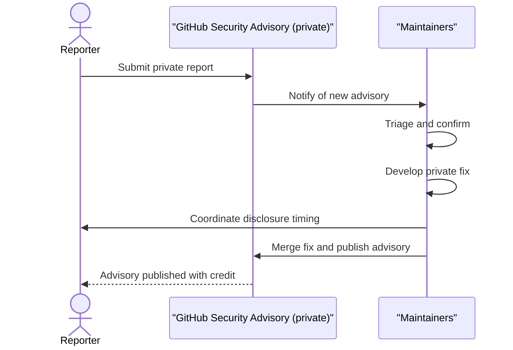
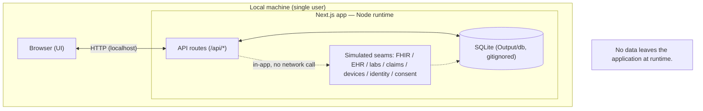

# Security policy

## Scope and posture

My Health Coach is a concept demonstration built with fictional data only. The running app makes no third-party network calls, transmits no protected health information (PHI), holds no real patient data, and stores no secrets or API keys. Every external integration is simulated in-app behind a clean interface seam, so the runtime attack surface is intentionally minimal.

## Supported versions

The demo tracks the `main` branch. Only the latest state on `main` receives fixes.

| Version                        | Supported |
| ------------------------------ | --------- |
| `main` (latest)                | Yes       |
| Older commits, tags, and forks | No        |

## Reporting a vulnerability

Report security issues privately through GitHub. Do not open a public issue for a vulnerability.

1. Go to the repository's **Security** tab.
2. Open **Advisories**, then select **Report a vulnerability**. Direct link: [Report a vulnerability](https://github.com/Scope-Infotech-Inc/my-health-coach-demo/security/advisories/new).
3. Include enough detail to reproduce:
   - the affected route or file (for example, an `/api/*` route or a `lib/` module);
   - step-by-step reproduction instructions;
   - the impact you observed or expect.

We aim to acknowledge a report within a few business days. This is a best-effort goal for a concept demo, not a contractual service-level agreement.

Please do not open public GitHub issues for vulnerabilities. Public issues are for non-sensitive bugs and questions; see [SUPPORT.md](SUPPORT.md).

## Coordinated disclosure flow

We follow coordinated disclosure. Reporters submit privately, we triage and fix in private, and we publish an advisory once a fix is available.

## Security model and trust boundary

The app runs on a single local machine. The browser talks to a Next.js server (Node runtime), which reads and writes one local SQLite file. Every external integration is drawn below as a dashed, in-app seam: it returns scripted data and makes no network call. No data leaves the application at runtime.

Two seams matter most for security:

- **`IdentityProvider`** runs scripted IAL2/AAL2 passkey and mobile driver's license (mDL) verification and returns a deterministic session token. In a production build it would swap to CMS digital identity and OAuth 2.0.
- **`AuditLog`** appends access events to the `access_log` table (actor, timestamp, scope, purpose-of-use). In a production build it would swap to a tamper-evident audit trail.

## Data handling and privacy

- All data is fictional. The app ships 13 fictional personas and contains no real patient records.
- Clinical codes are illustrative only. LOINC (labs), RxNorm (medications), and SNOMED CT (conditions) values are placeholders and must be validated against current official value sets before any production use.
- Runtime file storage lives under `Output/` (database, documents, exports, uploads, logs). `Output/` is gitignored and stays local to the machine running the demo.
- All `.env*` files are gitignored. The repository contains no secrets or API keys.
- The demo clock is fixed at 2026-06-06, so application state is deterministic.

## Compliance alignment

Scope Infotech, Inc. develops My Health Coach aligned with the Federal Information Security Modernization Act (FISMA), NIST SP 800-53 Rev. 5 (toward a FIPS 199 MODERATE baseline), NIST SP 800-171, the HIPAA Security Rule, and Section 508 / WCAG 2.1 AA.

The demo is fully simulated and processes no real PHI. These standards describe the **production-target security posture**, not active compliance of the demo. The mappings below tie specific controls to the seams where a production build would implement them:

- **Audit logging.** The `AuditLog` seam and the `access_log` table are where NIST SP 800-53 Rev. 5 AU-2 (Event Logging) and AU-3 (Content of Audit Records) would be implemented.
- **Identity and authentication.** Identity verification through the `IdentityProvider` seam maps to NIST SP 800-53 Rev. 5 IA-2 (Identification and Authentication).
- **Boundary protection.** The application and runtime boundary maps to NIST SP 800-53 Rev. 5 SC-7 (Boundary Protection).
- **Access control.** Consent handling and read-access tracking relate to the NIST SP 800-53 Rev. 5 AC (Access Control) family.

No other control mappings, FAR/DFARS clauses, or contract details are claimed here.

## Dependencies

The dependency surface is small and reviewed before any update is adopted.

- Runtime: `better-sqlite3`, `next`, `react`, `react-dom`.
- Development only: `tsx`, `typescript`, and `@types/*` type packages.
- Node.js 20 or later is required.

`better-sqlite3` is a native addon (it compiles against the local platform). Treat updates to it with the same review applied to other dependencies.

## Out of scope

The following do not apply to a simulated, local, single-user demo:

- The fictional seed data and the 13 personas. They are intentional sample content, not a data exposure.
- Local-only denial of service. The app runs on the operator's own machine with no shared service.
- Real external endpoints. There are none; FHIR, EHR, labs, claims, devices, identity, and consent are all simulated in-app and make no network call.

---

 

**Copyright © 2026 Scope Infotech, Inc. All rights reserved.**

My Health Coach is a concept demonstration. It is not an official CMS product and is not for clinical use.

