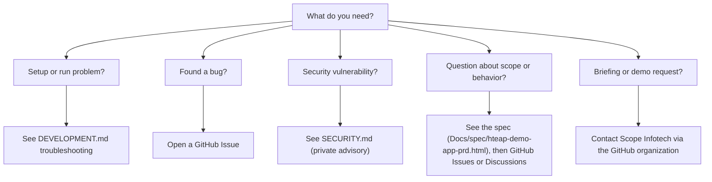

# Support

My Health Coach is a concept demonstration for the CMS HTEAP "Patient-Facing Apps — Diabetes & Obesity" use case. Support is best-effort and routed through GitHub. This page shows where to go for each kind of request.

## How do I get help?

Use the decision tree below to find the right channel.

## Documentation index

- [README.md](README.md) — what the app is and how to run it.
- [ARCHITECTURE.md](ARCHITECTURE.md) — system design and the simulation seams.
- [DEVELOPMENT.md](DEVELOPMENT.md) — local setup, scripts, and troubleshooting.
- [CONTRIBUTING.md](CONTRIBUTING.md) — how to propose changes.
- [Product requirements (Docs/spec/hteap-demo-app-prd.html)](Docs/spec/hteap-demo-app-prd.html) — the normative specification.
- [User stories (Docs/spec/USER-STORIES.md)](Docs/spec/USER-STORIES.md) — acceptance criteria for each feature.

## Reporting a bug

Open a GitHub Issue at the [issue tracker](https://github.com/Scope-Infotech-Inc/my-health-coach-demo/issues). Include:

- the persona in use (for example, `sarah`);
- the viewport: mobile (`<880px`) or desktop (`≥880px`);
- the route where the problem appears;
- the steps to reproduce;
- expected result versus actual result;
- any console errors.

The demo clock is fixed at 2026-06-06, so behavior is deterministic. That makes most bugs straightforward to reproduce from these steps.

For security vulnerabilities, do not open a public issue. Follow the private process in [SECURITY.md](SECURITY.md).

## Asking questions

Ask questions through GitHub [Issues](https://github.com/Scope-Infotech-Inc/my-health-coach-demo/issues), or through [Discussions](https://github.com/Scope-Infotech-Inc/my-health-coach-demo/discussions) if Discussions is enabled on the repository. For questions about scope, features, or intended behavior, check the [product requirements](Docs/spec/hteap-demo-app-prd.html) first.

## Known limitations and FAQ

- **Fully simulated.** Every integration (FHIR/Aligned Network, EHR, labs, claims, devices, identity, consent, documents, terminology, AI interpretation) is faked in-app. The assistant is a deterministic on-device intent engine; there is no large language model and no inference request leaves the app.
- **Single-user, local demo.** The app runs on one machine for one operator. It is not a multi-user or hosted service.
- **Fixed demo date.** "Today" is always 2026-06-06. Dates, chart ranges, and copy derive from that date.
- **No real connectivity, accounts, or PHI.** There are no real network calls, user accounts, or protected health information.
- **Illustrative clinical codes.** LOINC, RxNorm, and SNOMED CT values are placeholders and must be validated against current official value sets before any production use.

## Briefing and commercial inquiries

For a briefing or a demo, contact Scope Infotech, Inc. through the [Scope-Infotech-Inc GitHub organization](https://github.com/Scope-Infotech-Inc), or reach out to your existing Scope point of contact.

---

 

**Copyright © 2026 Scope Infotech, Inc. All rights reserved.**

My Health Coach is a concept demonstration. It is not an official CMS product and is not for clinical use.

